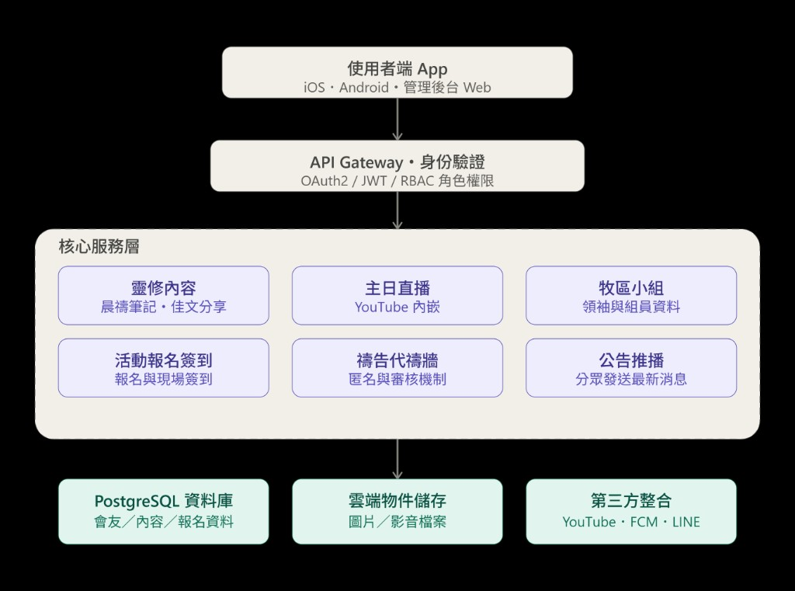

# 教會 APP 系統設計文件

版本：v1.1　更新日期：2026-07-21（新增：活動報名與簽到、禱告代禱牆）

---

## 一、市場調研摘要

### 1. 國際主流教會 APP 平台（2026）

| 平台 | 定位 | 優點 | 缺點 | 參考價格 |
|---|---|---|---|---|
| **Subsplash** | 媒體/直播為主的一站式教會數位生態系 | 影音串流、多校區支援、上架代管成熟 | 不含原始碼所有權、模板化、合約 12–24 個月 | 約 US$200–500/月 + 設定費 |
| **Church Center (Planning Center)** | 與 Planning Center ChMS 深度整合 | 若已用 PC 排班、會友資料，銜接最順 | 客製化有限，非獨立白牌 App | 隨 PC 訂閱 |
| **Pushpay / ChurchStaq** | 以奉獻/什一奉獻為核心 | 線上奉獻轉換率高 | 偏企業、費用高 | 企業報價 |
| **Tithe.ly** | 平價/免費入門 | 有免費層，適合小型教會 | 模板化、無原始碼所有權 | 免費起 |
| **自建 (React Native / Flutter)** | 客製開發 | 完全掌握原始碼、資料主權、UI/UX 自由 | 需開發與維運資源 | 依規模而定 |

**趨勢**：2026 年討論聚焦「原始碼所有權」與「資料自主權」。SaaS 一旦停約 App 便下架、資料難匯出。本專案採**自建/半自建**（開源 App 框架 + 自架後端）。

### 2. 台灣教會常見作法

多以 **LINE 官方帳號 + 群組推播 + 官網** 拼裝。缺點：內容分散、無法個人化、個資不在教會掌控。本專案價值在於「**內容整合 + 個人化工具**」。

---

## 二、功能需求規劃（七項核心）

| # | 功能 | 說明 | 延伸設計 |
|---|---|---|---|
| 1 | 晨禱靈修筆記 | 每日撰寫個人靈修筆記 | 雲端同步、每日經文推播、私人可見（預設不公開）、可選擇性分享到小組 |
| 2 | 主日崇拜 YouTube 連結 | 顯示直播/回放 | YouTube Data API 內嵌播放器、自動抓最新影片 |
| 3 | 靈修佳文分享 | 文章型內容 | 後台 CMS 上稿、支援分類 |
| 4 | 牧區領袖・小組介紹 | 靜態/半靜態資料頁 | 目錄式資料（照片、簡介、時間地點、聯絡方式，注意個資範圍）|
| 5 | 牧區最新資訊 | 公告/行事曆 | 與推播綁定、分眾發送 |
| 6 | 活動報名與簽到 | 報名 + 現場掃碼簽到 | 見 6.1 |
| 7 | 禱告代禱牆 | 發布/瀏覽代禱事項 | 見 6.2，**隱私與內容審核為必要項目**|

### 6.1 活動報名與簽到

**流程**：後台建活動（名額/截止）→ 會友報名（即時扣名額、額滿轉候補）→ 當天動態 QR Code 或掃會員條碼簽到 → 回寫資料庫供出席統計。

**資料設計**：`events`、`event_registrations`（已報名/候補/已取消）、`event_checkins`（時間、方式）。QR Code 採**短效期動態 Token**（每 30 秒更新或當天才產生）避免截圖重用。兒少活動需監護人同意欄位。

**資安/隱私**：簽到屬「行蹤/出席紀錄」，僅主辦同工與管理員可查看名單；報名只蒐集最少必要欄位。

### 6.2 禱告代禱牆（隱私與敏感內容為核心）

**發布權限與可見範圍**（預設「私人」）：
- 私人（僅自己與代禱同工）／小組可見（本牧區小組成員）／公開（全教會）
- 允許**匿名發布**（顯示「一位弟兄姊妹」），後台保留可追溯真實身份供稽核（須於使用條款告知）

**內容審核**：
- 選項一（中小型，推薦）：公開內容**發布前人工審核**；私人/小組可略過
- 選項二（大型）：**自動內容過濾**（敏感詞）+ 事後巡查 + 檢舉
- 提供「檢舉」按鈕觸發同工複核

**特別敏感情境**：
- 自傷/自殺意念/家暴/精神健康危機：**優先通知牧者/關懷同工**，不先公開曝光
- 涉及第三人：提示是否已取得當事人同意
- 涉及未成年：避免公開姓名與可識別細節

**資料設計**：`prayer_requests`（內容、可見範圍、匿名、審核狀態）、`prayer_responses`（代禱人、可選顯示人數）。**匿名↔真實身份對應需分表加密**、存取權限更嚴。保留刪除/下架機制。

**延伸**：資料保存期限（如 30 天自動封存）、指派專責「代禱牆管理同工」。

---

## 三、系統架構

**1. 使用者端**：iOS/Android（React Native 或 Flutter）、管理後台 Web（React/Vue）。
**2. API Gateway / 身份驗證**：統一入口、rate limiting、集中式驗證；OAuth2/OIDC + 短效期 JWT + refresh token；RBAC 至少四級（一般會友 / 小組長 / 牧區同工 / 系統管理員）。
**3. 核心服務層**（模組化單體，日後視流量拆微服務）：靈修內容、直播/影音、牧區小組、活動報名簽到、禱告代禱牆（權限更嚴）、公告推播。
**4. 資料層與外部整合**：PostgreSQL、物件儲存（S3/GCS）、YouTube Data API（唯讀）、推播、LINE（選用）。

---

## 四、資安規則（OWASP MASVS 2026 + 台灣個資法）

1. **STORAGE**：裝置端不存明文密碼/token（Keychain/Keystore）；敏感內容伺服器端 AES-256 欄位加密；不寫入一般 log。
2. **CRYPTOGRAPHY**：所有 API 強制 TLS 1.3；密碼用 bcrypt/argon2，不自製加密。
3. **AUTH**：OAuth2/OIDC；短效期 token + refresh；登出撤銷 token；後台強制 2FA。
4. **NETWORK**：憑證驗證，敏感操作可加 certificate pinning；API 速率限制防暴力破解/爬取。
5. **PLATFORM**：權限最小化；YouTube 用官方 embed 並限白名單網域；Deep link 驗證來源。
6. **CODE**：定期掃第三方套件；金鑰/密碼不寫死前端，用後端環境變數/密鑰管理服務。
7. **RESILIENCE**：root/jailbreak 偵測、混淆優先級較低；重點防帳號枚舉與批次爬取。
8. **台灣個資法**：告知義務、蒐集最小化、當事人權利（查/改/刪）、未成年監護人同意、資料保存與刪除政策、代禱牆特種個資更嚴、活動簽到行蹤資料不對一般會友公開。
9. **管理面**：RBAC + 最小權限（小組長只能編自己小組）、後台稽核紀錄、事件應變流程、定期備份並演練復原。

---

## 五、建議技術棧

| 層級 | 技術 |
|---|---|
| 行動端 | React Native（或 Flutter）|
| 管理後台 | React / Next.js |
| 後端 API | Node.js（NestJS）REST/GraphQL |
| 資料庫 | PostgreSQL |
| 物件儲存 | AWS S3 / GCP Cloud Storage |
| 推播 | Firebase Cloud Messaging |
| 影音 | YouTube Data API v3 |
| 資安掃描 | OWASP MASVS 對照表 + MobSF（CI/CD）|

---

## 六、開發階段

- **一 (MVP, 2–3 月)**：帳號/RBAC、YouTube 連結、靈修佳文、小組介紹、基本推播
- **二**：晨禱筆記（同步+提醒）、後台 CMS、分眾推播、活動報名（先後台名單匯出）
- **三**：禱告代禱牆（先私人/小組可見 + 審核，公開牆與匿名後行）、動態 QR Code 簽到
- **四**：奉獻（獨立評估金流與資安）

---

## 七、後續建議

1. 先畫核心頁面線框圖確認資訊架構
2. 完成 MVP 後找 10–20 位會友內測
3. 上線前跑一次 OWASP MASVS L1 基礎檢查清單
